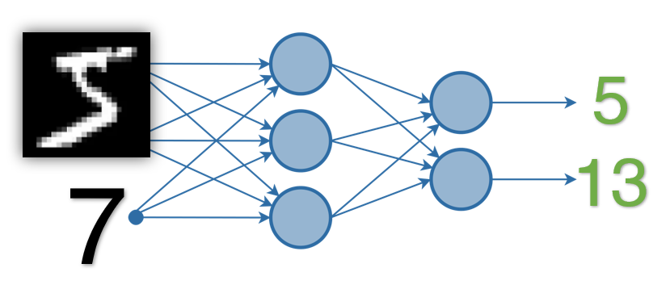

# Pytorch 101 : Image Classifier and Number Addition

## Write a neural network that can

1. take 2 inputs:
   1. an image from MNIST dataset, and
   2. a random number between 0 and 9
2. and gives two outputs:
   1. the "number" that was represented by the MNIST image, and
   2. the "sum" of this number with the random number that was generated and sent as the input to the network
         
3. you can mix fully connected layers and convolution layers
4. you can use one-hot encoding to represent the random number input as well as the "summed" output. 


## Data Representation:

Data for supervised model should be in this format:  `(input, label)` 

Inputs:
1. Mnist Image > Converted to `torch.Tensor'
2. Random number

Outputs:
1. label for mnist image
2. label + random number

Finally `(input, target)` : `(img, random_number),  (label, label + random_number)`

## Data Generation Strategy:

Step1. Use torch.utils.data.DataLoader to load MNIST data
Step2. Inside `__getitem__`, generate random number.
Step3. return [x,y] : [`(img, random_number),  (label, label + random_number)`]

```python
# Create a class to combine MNIST dataset and random numbers between 0 and 9
class Combined_Dataset():

  # We pass the train variable to get train or test data, and batch_size
  def __init__(self, train, batch_size):

      self.batch_size = batch_size
      # Load the MNIST data into the data_loader object
      self.data_loader = torch.utils.data.DataLoader(
          torchvision.datasets.MNIST('/files/', train=train, download=True,
                                transform=torchvision.transforms.Compose([
                                  torchvision.transforms.ToTensor(),
                                  torchvision.transforms.Normalize(
                                    (0.1307,), (0.3081,))
                                ])),
          batch_size=self.batch_size, shuffle=True)

      # Number of samples in the dataaset
      self.dataset = self.data_loader.dataset            

  # getitem function creats batches of our dataset on the fly by calling next(iter())
  def __getitem__(self, index):
      # Extract one batch of the MNIST data_loader
      image, label = next(iter(self.data_loader))

      # Generate randoms numbers between 0 and 9 of size=batch_size. The datatype is float as this is the input required for the network
      random_numbers = torch.tensor([randint(0,9) for _ in range(self.batch_size)], dtype=torch.float32)

      # Combine inputs and outputs as a list after transfering the tensors to the GPU
      x = [image.to(device), random_numbers.to(device)]
      # y labels for addition of number is reshaped to [32,1] as MSE requires it in this format
      y = [label.to(device), (label+random_numbers).reshape([32,1]).to(device)]

      return x, y

  def __len__(self):
      return len(self.data_loader)
```


## Model Architecture : Combining Two Inputs

Dimension of image data and randomly generated number are different, so we need to get both inputs on same page:

Step 1: For Image : `Image` > `{Convolution Network(say feature extractor)}` > Flattened output
Step 2. Flattened output + random number > `{Fully Connected Network}` > two outputs


```python
# Build the classifier and addition network
class Network(nn.Module):
    def __init__(self):
        super().__init__()

        # Classifier Network
        self.input1 = nn.Conv2d(in_channels=1, out_channels=16, kernel_size=3) # output size = 26
        self.conv1 = nn.Conv2d(in_channels=16, out_channels=32, kernel_size=3) # 24
        self.conv2 = nn.Conv2d(in_channels=32, out_channels=64, kernel_size=3) # 22
        self.pool = nn.MaxPool2d(2, 2) # 11

        # 1x1 convolution
        self.oneconv1 = nn.Conv2d(in_channels=64, out_channels=16, kernel_size=1) # 11
        
        self.conv3 = nn.Conv2d(in_channels=16, out_channels=32, kernel_size=3) # 9
        self.conv4 = nn.Conv2d(in_channels=32, out_channels=64, kernel_size=3) # 7
        self.conv5 = nn.Conv2d(in_channels=64, out_channels=64, kernel_size=3) # 5
        self.conv6 = nn.Conv2d(in_channels=64, out_channels=10, kernel_size=5) # 1

        # Addition network using fully connected layers
        self.input2 = nn.Linear(in_features=2, out_features=5)
        self.layer1 = nn.Linear(in_features=5, out_features=5)
        self.out2 = nn.Linear(in_features=5, out_features=1)

    def forward(self, data1, data2):
        # Classifier Network forward prop
        # first block
        x = F.relu(self.input1(data1))
        x = F.relu(self.conv1(x))
        x = self.pool(F.relu(self.conv2(x)))
        x = F.relu(self.oneconv1(x))
        
        # second block
        x = F.relu(self.conv3(x))
        x = F.relu(self.conv4(x))
        x = F.relu(self.conv5(x))

        # third block
        x = self.conv6(x)
        output1 = torch.flatten(x, start_dim=1) # flatten all dimensions except batch      

        # Addition Network
        # Collect the output of the classifier network and select the index with maximum value
        x = torch.argmax(output1, dim=1)
        # Use torch.stack to create pairs of network outputs and random numbers
        x  = torch.stack((x.float(), data2), dim=1)
        
        # Pass the data through the addition network. No activation function required as addition of two numbers is a linear function
        x = self.input2(x)
        x = self.layer1(x)
        output2 = self.out2(x)

        # Return outputs from both the classifier and addition network
        return output1, output2
```
## Loss Strategy

1. MNIST Loss | Classification Problem | Cross-Entropy_loss(image_label, image_prediction)
2. Add-thingy loss | Regression type problem | MSE_Loss (image_label+random_number, image_prediction+label_prediction)


## Training the Model

```python
for epoch in range(10):  # Loop over the dataset multiple times

    total_loss = 0.0
    total_correct_1, total_correct_2 = 0, 0
    # Loop over the entire length of train data
    for i in range(len(train_data)):
        # Get the inputs and outputs
        # Input data x is a list of [images, random numbers], output data y is a list of [classes, sum of numbers]
        x, y = next(iter(train_data))

        # Zero the parameter gradients
        optimizer.zero_grad()

        # Forward + Backward + Optimize
        output1, output2 = model(x[0], x[1])
        # Use the CE loss for classification and MSE loss for addition 
        loss = CE_loss(output1, y[0]) + MSE_loss(output2, y[1])
        loss.backward()
        optimizer.step()

        # Calculate statistics
        total_loss += loss.item()
        total_correct_1 += output1.argmax(dim=1).eq(y[0]).sum().item()
        total_correct_2 += (torch.round(output2) == torch.round(y[1])).sum().item()
        
    # Print statistics        
    print(f"Epoch: {epoch+1}, loss: {total_loss}, Classification Acc: {100 * (total_correct_1/(len(train_data.dataset)))}, Addition Acc: {100 * (total_correct_2/(len(train_data.dataset)))}")
```


## Evaluating the Model

Both MNIST Predictions and Addition Predictions are evaluated saperately.

But Final accuracy can be taken as : mean(MNIST_acc,Add-thingy_ACC)

```python
correct_1, correct_2 = 0, 0
total_1, total_2 = 0, 0

# Since we're not training, we don't need to calculate the gradients for our outputs
with torch.no_grad():
    # Loop over the entire length of test data
    for i in range(len(test_data)):
        # Get the inputs and outputs
        # Input data x is a list of [images, random numbers], output data y is a list of [classes, sum of numbers]
        x, y = next(iter(test_data))

        # Calculate outputs by running data through the network 
        output1, output2 = model(x[0], x[1])

        # The class with the highest energy is what we choose as prediction
        _, predicted = torch.max(output1.data, 1)
        total_1 += y[0].size(0)
        # Calculate number of correction predictions for classifier
        correct_1 += (predicted == y[0]).sum().item()

        total_2 += y[1].to(device).size(0)
        # Calculate number of correction predictions for addition
        correct_2 += (torch.round(output2) == torch.round(y[1])).sum().item()

print('Accuracy of the network on the 10,000 test images: ', (100 * correct_1 / total_1))
print('Accuracy of the network on the 10,000 test images: ', (100 * correct_2 / total_2))
```


## Training Log

```
Epoch: 1, loss: 17133.129095613956, Classification Acc: 34.196666666666665, Addition Acc: 19.40833333333333
Epoch: 2, loss: 1992.754824128002, Classification Acc: 95.30499999999999, Addition Acc: 84.34666666666666
Epoch: 3, loss: 1118.9857528484426, Classification Acc: 97.425, Addition Acc: 93.89833333333333
Epoch: 4, loss: 776.5022496334277, Classification Acc: 98.10833333333333, Addition Acc: 96.68166666666667
Epoch: 5, loss: 652.799082744401, Classification Acc: 98.46833333333333, Addition Acc: 97.64166666666667
Epoch: 6, loss: 531.785650413367, Classification Acc: 98.70833333333333, Addition Acc: 98.12166666666667
Epoch: 7, loss: 467.3061952141579, Classification Acc: 98.895, Addition Acc: 98.19333333333333
Epoch: 8, loss: 436.9414788761642, Classification Acc: 99.04166666666666, Addition Acc: 98.61333333333333
Epoch: 9, loss: 368.7780215948587, Classification Acc: 99.15, Addition Acc: 98.86333333333333
Epoch: 10, loss: 346.73825165929156, Classification Acc: 99.225, Addition Acc: 98.99166666666666
Finished Training
```

