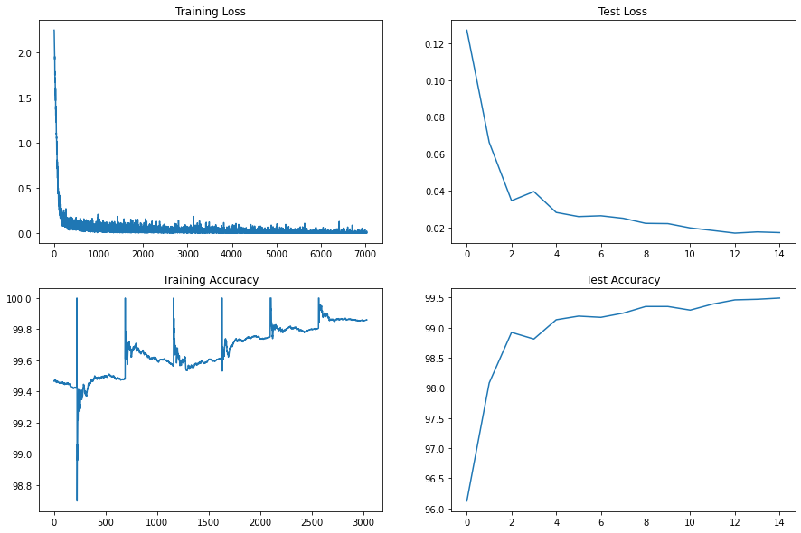
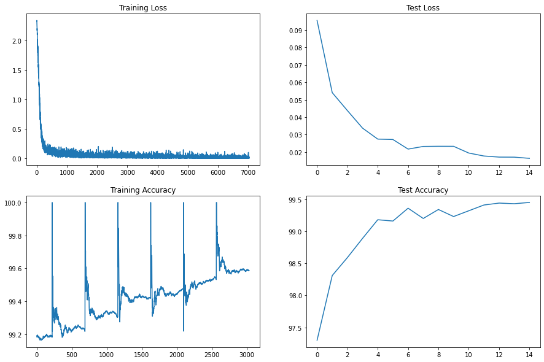
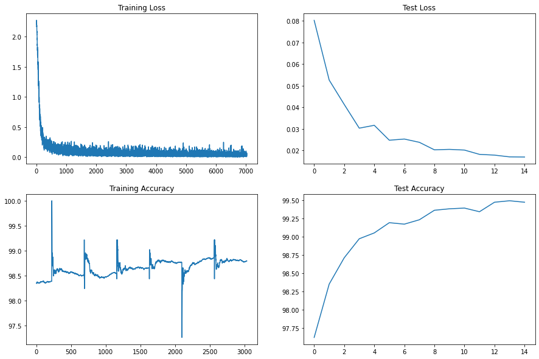

# Coding Drill Down

Documenting steps to achieve above 99.4% test accuracy on MNIST under 8000 Parameters and 15 Epochs

## Code 1 

[Colab code](https://github.com/bhuvnk/EVA6/blob/main/Session%205%20Coding%20Drill%20Down%20/%20Model_Training_Drill_Down_01.ipynb)

### 1. Target
Already had a base training pipeline from previous assignment, we'll work on top of that to improve.

- Write a decent architecture to start with
- From previous assignment noticed that wide first conv-block gives good accuracy, so shall expand the first block till 32
- Mostly follow excite-squeeze methodology
- No dropout, no data augmentation
- 15 Epochs
- OneCycleLR from get go; because it works!!

### 2. Result

- Params: `10_472`
- Best Train Accuracy: `99.86%`
- Best Test Accuracy : `99.49%`

### 3. Analysis

- Model is not really overfitting, but the train-test accuracy gap can be reduced more by some dropouts
- Need to reduce the parameteres under 10000

### Model Summary

```
- Convolution Block 1
    - `Conv2D:  1,  8, 3; Out: 26x26x8`
    - `Conv2D:  1, 16, 3; Out: 24x24x16`
    - `Conv2D: 16, 32, 3; Out: 22x22x32`
- Transition Block
    - `Conv2D: 32, 08, 1; Out: 22x22x8`
    - `MaxPool2D: 2x2;    Out: 11x11x8`
- Convolution Block 2
    - `Conv2D:  8,  8, 3; Out: 9x9x8`
    - `Conv2D:  8, 16, 3; Out: 7x7x16`
    - `Conv2D: 16, 16, 3; Out: 5x5x16`
- GAP
    - `AdaptiveAvgPool2d: -;    Out: 1x1x16`
    - `Conv2D:  -, 10, 1; Out: 1x1x10`
```

### Train/Test Loss and accuracy trend versus epochs


## Code 2

[Colab code](https://github.com/bhuvnk/EVA6/blob/main/Session%205%20Coding%20Drill%20Down%20/%20Model_Training_Drill_Down_02.ipynb)

### 1. Target

- First things first: Reduce the Parameteres
- We start with removing the first convblock of block1
- Dropout=0.1 Only in the first block to combat slight overfitting
- 15 Epochs
- OneCycleLR from get go; because it works!!

### 2. Result

- Params: `9_376`
- Best Train Accuracy: `99.59%`
- Best Test Accuracy : `99.45%`

### 3. Analysis

- **Target Acheived**
- Train and Test accuracies are in good place.
- Model is not still at 28x28 Receptive Field, that means there is chance of improvement

### Model Summary

```
- Convolution Block 1
    - `Conv2D:  1, 16, 3; Out: 26x26x16`
    - `Conv2D: 16, 32, 3; Out: 24x24x32`
- Transition Block
    - `Conv2D: 32, 08, 1; Out: 24x24x8`
    - `MaxPool2D: 2x2;    Out: 12x12x8`
- Convolution Block 2
    - `Conv2D:  8,  8, 3; Out: 10x10x8`
    - `Conv2D:  8, 16, 3; Out: 8x8x16`
    - `Conv2D: 16, 16, 3; Out: 6x6x16`
- Output GAP
    - `AdaptiveAvgPool2d: -;  Out: 1x1x16`
    - `Conv2D:  -, 10, 1; Out: 1x1x10`
```

### Train/Test Loss and accuracy trend versus epochs



## Code 3

[Colab code](https://github.com/bhuvnk/EVA6/blob/main/Session%205%20Coding%20Drill%20Down%20/%20Model_Training_Drill_Down_03.ipynb)

### 1. Target

- Trim the parameters below 8000
- Dropout=0.069 after each layer to avoid all overfitting
- no augmentation
- OneCycleLR from get go; because it works!!

### 2. Result

- Params: `7_864`
- Best Train Accuracy: `98.03%`
- Best Test Accuracy : `99.37%`

### 3. Analysis

- No overfitting
- Now time to add some data augmentations


### Model Summary

```
- Convolution Block 1
    - `Conv2D:  1, 14, 3; pad = 1; Out: 28x28x16`
    - `Conv2D: 14, 28, 3; pad = 1; Out: 28x28x32`
- Transition Block
    - `Conv2D: 28,  8, 1; Out: 24x24x8`
    - `MaxPool2D: 2x2;    Out: 12x12x8`
- Convolution Block 2
    - `Conv2D:  8,  12, 3; Out: 10x10x8`
    - `Conv2D: 12, 12, 3; Out: 8x8x16`
    - `Conv2D: 12, 16, 3; Out: 6x6x16`
    - `Conv2D: 16, 16, 3; Out: 4x4x16`
- Output GAP
    - `AdaptiveAvgPool2d: -;  Out: 1x1x14`
    - `Conv2D:  -, 10, 1; Out: 1x1x10`
    
```

### Train/Test Loss and accuracy trend versus epochs


## Code 4

[Colab code](https://github.com/bhuvnk/EVA6/blob/main/Session%205%20Coding%20Drill%20Down%20/%20Model_Training_Drill_Down_04.ipynb)

### 1. Target

- Augmentation : Rotation (-5, 5)
- Dropout=0.069 after each layer to avoid all overfitting
- OneCycleLR from get go; because it works!!

### 2. Result

- Params: `7_864`
- Best Train Accuracy: `98.86%`
- Best Test Accuracy : `99.49%`

### 3. Analysis

- Train accuracy is following Test accuracy.
- Add another Maxpool layer with correct positions


### Model Summary

```
- Convolution Block 1
    - `Conv2D:  1, 14, 3; pad = 1; Out: 28x28x16`
    - `Conv2D: 14, 28, 3; pad = 1; Out: 28x28x32`
- Transition Block
    - `Conv2D: 28,  8, 1; Out: 24x24x8`
    - `MaxPool2D: 2x2;    Out: 12x12x8`
- Convolution Block 2
    - `Conv2D:  8,  12, 3; Out: 10x10x8`
    - `Conv2D: 12, 12, 3; Out: 8x8x16`
    - `Conv2D: 12, 16, 3; Out: 6x6x16`
    - `Conv2D: 16, 16, 3; Out: 4x4x16`
- Output GAP
    - `AdaptiveAvgPool2d: -;  Out: 1x1x14`
    - `Conv2D:  -, 10, 1; Out: 1x1x10`
```

### Train/Test Loss and accuracy trend versus epochs


