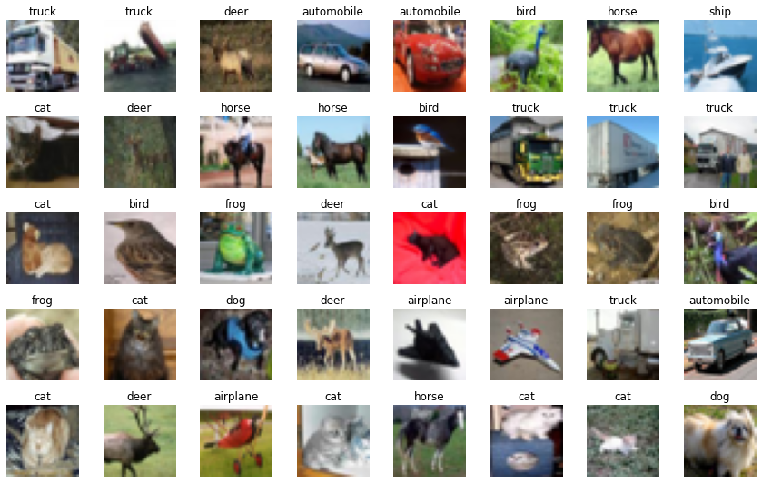
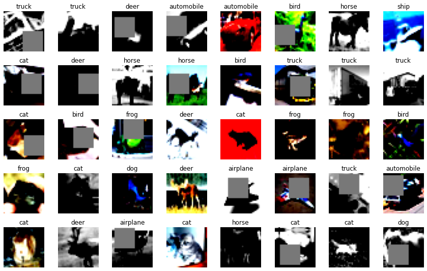
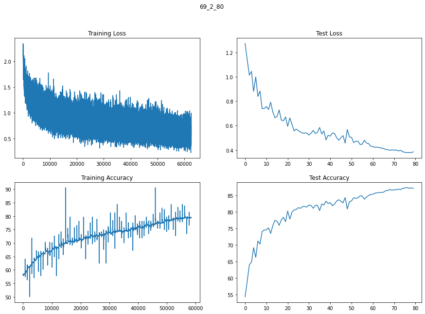
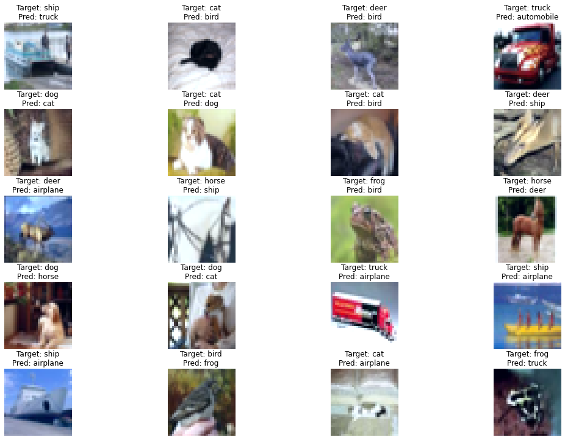

# CIFAR10-S7

## Target:
1. Network Design - 
    C1 | C2 | C3 | ~C4~ | O
    - No Max Pooling | No Stride of 2 | **Just Dialeted Kernels**
    - RF : 52
    - 4 Sets of Depthwise Separable Convolutions
    - 1 Dialeted Kernel

2. Augmentations, using `Albumentations`
    - horizontal flip
    - shiftScaleRotate
    - CoarseDropout (1,16,16,1,16,16, fill_value=(mean of data))
    - grayscaleHorizontal Flip 

3. **`68,992 parameters; 87% validation accuracy`**

## Data

Working with Cifar-10 dataset

**Before Augmentation and normalization**



**After Augmentation and normalization**




## Model Summary

```
----------------------------------------------------------------
        Layer (type)               Output Shape         Param #
================================================================
            Conv2d-1           [-1, 32, 32, 32]             864
              ReLU-2           [-1, 32, 32, 32]               0
       BatchNorm2d-3           [-1, 32, 32, 32]              64
            Conv2d-4           [-1, 32, 32, 32]             288
            Conv2d-5           [-1, 64, 32, 32]           2,048
              ReLU-6           [-1, 64, 32, 32]               0
       BatchNorm2d-7           [-1, 64, 32, 32]             128
            Conv2d-8           [-1, 32, 32, 32]           2,048
            Conv2d-9           [-1, 32, 32, 32]           9,216
             ReLU-10           [-1, 32, 32, 32]               0
      BatchNorm2d-11           [-1, 32, 32, 32]              64
           Conv2d-12           [-1, 32, 32, 32]             288
           Conv2d-13           [-1, 64, 32, 32]           2,048
             ReLU-14           [-1, 64, 32, 32]               0
      BatchNorm2d-15           [-1, 64, 32, 32]             128
           Conv2d-16           [-1, 64, 24, 24]          36,864
             ReLU-17           [-1, 64, 24, 24]               0
      BatchNorm2d-18           [-1, 64, 24, 24]             128
           Conv2d-19           [-1, 32, 24, 24]           2,048
           Conv2d-20           [-1, 32, 24, 24]             288
           Conv2d-21           [-1, 64, 24, 24]           2,048
             ReLU-22           [-1, 64, 24, 24]               0
      BatchNorm2d-23           [-1, 64, 24, 24]             128
           Conv2d-24           [-1, 64, 24, 24]             576
           Conv2d-25          [-1, 128, 24, 24]           8,192
             ReLU-26          [-1, 128, 24, 24]               0
      BatchNorm2d-27          [-1, 128, 24, 24]             256
AdaptiveAvgPool2d-28            [-1, 128, 1, 1]               0
           Conv2d-29             [-1, 10, 1, 1]           1,280
================================================================
Total params: 68,992
Trainable params: 68,992
Non-trainable params: 0
----------------------------------------------------------------
Input size (MB): 0.01
Forward/backward pass size (MB): 9.19
Params size (MB): 0.26
Estimated Total Size (MB): 9.46
```
1.  `68_992` parameters, with 4 depthwise separable convolutions, 1 dilated convolution.

| Layer # | Kernel | Stride | Dilation | Padding | Input | Output | RF   |
| ------- | ------ | ------ | -------- | ------- | ----- | ------ | ---- |
| 1       | 3      | 1      | 1        | 1       | 32    | 32     | 3    |
| 2       | 3      | 1      | 1        | 1       | 32    | 32     | 5    |
| 3       | 1      | 1      | 1        | 0       | 32    | 32     | 5    |
| 4       | 1      | 1      | 1        | 0       | 32    | 32     | 5    |
| 5       | 3      | 1      | 1        | 1       | 32    | 32     | 7    |
| 6       | 3      | 1      | 1        | 1       | 32    | 32     | 9    |
| 7       | 3      | 1      | 4        | 0       | 32    | 24     | 17   |
| 8       | 1      | 1      | 1        | 0       | 24    | 24     | 17   |
| 9       | 3      | 1      | 1        | 1       | 24    | 24     | 19   |
| 10      | 1      | 1      | 1        | 0       | 24    | 24     | 19   |
| 11      | 3      | 1      | 1        | 1       | 24    | 24     | 21   |
| 12      | 1      | 1      | 1        | 0       | 24    | 24     | 21   |
| 13      | 24     | 1      | 1        | 0       | 32    | 1      | 45   |


## Results
1. Validation accuracy
    a.  `85.32% in 60 epochs`
    b.  `87.10% in 75 epochs`
    
2.  Train, Validation Plots


## Misclassified Images



## Training Logs
```
EPOCH 71 and Learning Rate [0.015324502257075004]: 
Loss=0.8166183829307556 Batch_id=781 Accuracy=78.21: 100%|██████████| 782/782 [00:28<00:00, 27.07it/s]
  0%|          | 0/782 [00:00<?, ?it/s]
Test set: Average loss: 0.3981, Accuracy: 8670/10000 (86.70%)

EPOCH 72 and Learning Rate [0.012474937988473146]: 
Loss=0.3190598785877228 Batch_id=781 Accuracy=78.63: 100%|██████████| 782/782 [00:28<00:00, 27.16it/s]
  0%|          | 0/782 [00:00<?, ?it/s]
Test set: Average loss: 0.4006, Accuracy: 8668/10000 (86.68%)

EPOCH 73 and Learning Rate [0.009900761204661693]: 
Loss=0.7743849754333496 Batch_id=781 Accuracy=78.86: 100%|██████████| 782/782 [00:28<00:00, 27.13it/s]
  0%|          | 0/782 [00:00<?, ?it/s]
Test set: Average loss: 0.3923, Accuracy: 8685/10000 (86.85%)

EPOCH 74 and Learning Rate [0.007610071218156189]: 
Loss=0.2570918798446655 Batch_id=781 Accuracy=79.17: 100%|██████████| 782/782 [00:28<00:00, 27.12it/s]
  0%|          | 0/782 [00:00<?, ?it/s]
Test set: Average loss: 0.3973, Accuracy: 8675/10000 (86.75%)

EPOCH 75 and Learning Rate [0.005610075387127873]: 
Loss=0.8765673041343689 Batch_id=781 Accuracy=79.14: 100%|██████████| 782/782 [00:28<00:00, 27.22it/s]
  0%|          | 0/782 [00:00<?, ?it/s]
Test set: Average loss: 0.3861, Accuracy: 8710/10000 (87.10%)

EPOCH 76 and Learning Rate [0.003907066438388321]: 
Loss=0.6855331659317017 Batch_id=781 Accuracy=79.15: 100%|██████████| 782/782 [00:29<00:00, 26.93it/s]
  0%|          | 0/782 [00:00<?, ?it/s]
Test set: Average loss: 0.3808, Accuracy: 8722/10000 (87.22%)

EPOCH 77 and Learning Rate [0.0025064026681429217]: 
Loss=0.4962536692619324 Batch_id=781 Accuracy=79.20: 100%|██████████| 782/782 [00:29<00:00, 26.93it/s]
  0%|          | 0/782 [00:00<?, ?it/s]
Test set: Average loss: 0.3789, Accuracy: 8734/10000 (87.34%)

EPOCH 78 and Learning Rate [0.0014124910828085392]: 
Loss=0.24698226153850555 Batch_id=781 Accuracy=79.39: 100%|██████████| 782/782 [00:28<00:00, 27.31it/s]
  0%|          | 0/782 [00:00<?, ?it/s]
Test set: Average loss: 0.3794, Accuracy: 8715/10000 (87.15%)

EPOCH 79 and Learning Rate [0.0006287735329409451]: 
Loss=0.5065107345581055 Batch_id=781 Accuracy=79.39: 100%|██████████| 782/782 [00:28<00:00, 26.99it/s]
  0%|          | 0/782 [00:00<?, ?it/s]
Test set: Average loss: 0.3780, Accuracy: 8726/10000 (87.26%)

EPOCH 80 and Learning Rate [0.00015771588389959499]: 
Loss=0.48169535398483276 Batch_id=781 Accuracy=79.49: 100%|██████████| 782/782 [00:28<00:00, 27.03it/s]

Test set: Average loss: 0.3847, Accuracy: 8712/10000 (87.12%)
```

## Observations
1.  So far, from experiments looks like going for high Receptive Field doesn't help if images don't have a lot of backgrounds.
2.  Depthwise seperable convolutions are great to keep parameteres low.
3.  There is only one way to go, one cycle LR
4.  Should have tried Resblocks.
